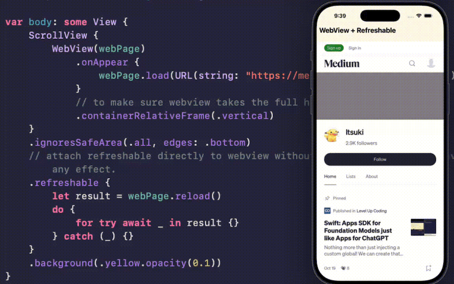

# SwiftUI_WebviewPullDownToRefresh
A simple implementation of pull down to refresh for SwiftUI WebView.

For more details, please refer to my blog [Little SwiftUI Tip:  Pull To Refresh For WebView](https://medium.com/@itsuki.enjoy/little-swiftui-tip-pull-to-refresh-for-webview-98042334c2d5).

